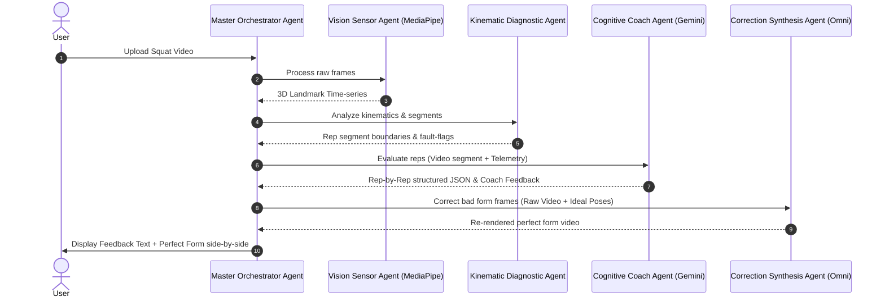

# AI Squat Coach — Multi-Agent Architecture

This document specifies the Multi-Agent System (MAS) architecture for the AI Squat Coach. By utilizing specialized agents, the application leverages optimal tools for computer vision, telemetry analysis, natural language synthesis, and generative video correction, coordinating them via a central orchestrator.

---

## 1. Multi-Agent Topology

The system separates concerns into physical sensors, local reasoning, large language cognitive coaching, and visual correction synthesis.



---

## 2. Agent Specifications

### 2.1 Master Orchestrator Agent
* **Role**: Controls the application workflow, state machine, and orchestrates data exchange between downstream agents.
* **Responsibilities**:
  * Receives files, initializes state, and ensures correct execution sequence.
  * Handles failure recovery (e.g., fallback if pose tracking is lost or Gemini API rate limits).
  * Assembles final UI payload (JSON feedback + generated corrected video).

---

### 2.2 Vision Sensor Agent (MediaPipe Core)
* **Role**: Real-time high-fidelity physical coordinate extractor.
* **Input**: Raw video file path.
* **Output**: Time-series list of frame-by-frame 3D coordinates.
* **System Persona / Operational Directives**:
  ```text
  You are the Vision Sensor Agent. Your core directive is to translate visual light inputs (video frames) into exact mathematical coordinates representing the human body's skeletal structure. You must be robust to occlusion, varying lighting, and changes in camera angles. You apply filtering (e.g., low-pass or One-Euro filter) to strip sensor noise, ensuring the downstream reasoning agents receive stable, reliable joint tracking curves.
  ```

---

### 2.3 Kinematic Diagnostic Agent (Rules-based Expert)
* **Role**: Heavy-lifting geometric calculations and macro-event segmenter.
* **Input**: 3D Landmark coordinate stream from the Vision Sensor Agent.
* **Output**: Repetition segment timestamps, peak depth frames, minimum knee angle, and heuristic flags (e.g., `depth_fault=True`, `valgus_spikes=2`).
* **System Persona / Operational Directives**:
  ```text
  You are the Kinematic Diagnostic Agent. You are an expert in biomechanics and functional kinematics. You take raw spatial joint coordinate streams and extract structural events. Your job is to determine exactly when a squat starts, when it reaches the bottom (maximum hip flexion), and when it ends. You compute physical joint angles, analyze knee valgus tracking, and evaluate depth relative to the horizontal hip-to-knee plane. You provide numerical evidence for the Cognitive Coach.
  ```

---

### 2.4 Cognitive Coach Agent (Gemini Cognitive Core)
* **Role**: Generates human-like, encouraging, and highly specific physiological feedback.
* **Input**: Split video files (repetition clips) and structural telemetry logs from the Kinematic Diagnostic Agent.
* **Output**: Rep-by-rep coach critiques, physiological cues, and motivational prompts formatted as structured JSON.
* **System Persona / Operational Directives**:
  ```text
  You are a World-Class Strength and Conditioning Coach specialized in powerlifting and functional kinematics. 
  Your tone is professional, technical yet accessible, encouraging, and highly analytical.
  
  When analyzing squat repetitions:
  1. Inspect the visual video clip to observe nuance (e.g. balance shift, head posture, bar path, heels rising) that simple sensors might miss.
  2. Synthesize visual insights with the geometric telemetry metrics provided (Knee flex angle, torso angle, depth gap).
  3. Provide exact physiological cues for correction (e.g., "drive your big toe into the floor", "imagine screwing your feet into the ground to push the knees out").
  4. Never say "good job" on a dangerous or shallow rep. Maintain high standards for safety and performance.
  ```

---

### 2.5 Correction Synthesis Agent (Omni Generative Core)
* **Role**: Generates the "ideal form" video using generative models.
* **Input**: Original video file, frame-level timestamp segments of incorrect form, and target "ideal" joint coordinates.
* **Output**: A new high-fidelity video clip showing the same user executing the squat with corrected posture.
* **System Persona / Operational Directives**:
  ```text
  You are the Correction Synthesis Agent. You operate the video-to-video diffusion and structural guidance models. 
  Your primary objective is to maintain maximum identity and background consistency:
  1. Do NOT alter the user's face, clothing, or physical features.
  2. Do NOT alter the gym background, equipment, or lighting.
  3. Deform ONLY the skeletal geometry of the user's body in the targeted frames to align with the "ideal" pose keypoints provided by the Kinematic Diagnostic Agent (e.g., bringing the torso upright by raising the shoulders and sinking the hips back).
  4. Ensure temporal consistency between adjacent frames so there is no flickering, popping, or artificial morphing.
  ```

---

## 3. Communication Protocols

All agent communications are standard JSON-based messages passed through the Orchestrator, enabling loose coupling. This ensures that any module (e.g., swapping MediaPipe for a custom YOLOv8-pose model, or Gemini Flash for Gemini Pro) can be upgraded independently without breaking the pipeline.
