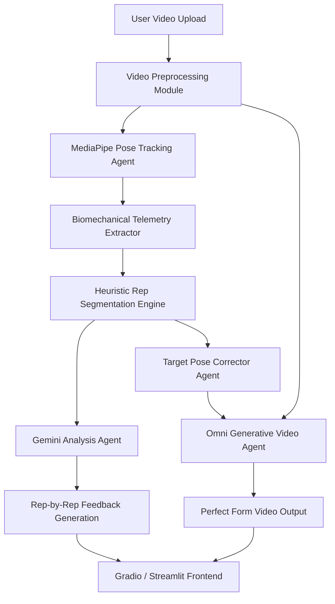

# AI Squat Coach — System Specifications

This document outlines the technical specifications, architecture, and data flows for the AI Squat Coach, a real-time computer vision and multimodal AI coaching prototype focusing on squats. The application analyzes a user's squat video, provides rep-by-rep biomechanical analysis, and synthesizes a generative corrected video showing the user performing a squat with perfect form.

---

## 1. System Architecture

The AI Squat Coach is designed around a modular pipeline that ingests raw video, processes physical geometry, generates a multimodal biomechanical critique, and uses a generative model to correct video frames.



---

## 2. Component Specifications

### 2.1 Video Preprocessor
* **Responsibility**: Ingest, decode, and normalize the user video.
* **Tech Stack**: OpenCV (`cv2`), ffmpeg.
* **Specifications**:
  * Downscales videos to a standard resolution (e.g., 720p at 30 FPS) to ensure predictable processing times.
  * Extracts metadata (frame rate, total frames, resolution, orientation).

### 2.2 MediaPipe Pose Tracking Agent
* **Responsibility**: Extract 3D skeletal landmarks from video frames.
* **Tech Stack**: `mediapipe.python.solutions.pose`.
* **Specifications**:
  * Utilizes `PoseLandmark` points: Left/Right Hip (23, 24), Knee (25, 26), Ankle (27, 28), Shoulder (11, 12), Ear (7, 8).
  * Tracks coordinates $(x, y, z)$ alongside tracking confidence visibility score $v \in [0, 1]$.
  * Applies a One-Euro filter or moving average filter to smooth raw tracking data and eliminate jitter.

### 2.3 Biomechanical Telemetry Extractor
* **Responsibility**: Translate raw coordinate landmarks into biomechanical metrics.
* **Calculations**:
  * **Knee Joint Flexion Angle**: 
    $$\theta_{\text{knee}} = \arccos\left(\frac{\vec{u} \cdot \vec{v}}{\|\vec{u}\| \|\vec{v}\|}\right)$$
    where $\vec{u} = \vec{P}_{\text{hip}} - \vec{P}_{\text{knee}}$ and $\vec{v} = \vec{P}_{\text{ankle}} - \vec{P}_{\text{knee}}$.
  * **Torso Lean (Hip Angle)**: Angle between torso segment ($\vec{P}_{\text{shoulder}} - \vec{P}_{\text{hip}}$) and the vertical gravity vector.
  * **Depth Metric**: Vertical distance ($y$-axis separation) between the Hip joint and the Knee joint.
  * **Knee Travel / Alignment**: Horizontal tracking of knees relative to ankles (detecting knee valgus/cave-in).

### 2.4 Heuristic Rep Segmentation Engine
* **Responsibility**: Automatically split a continuous video into individual squat repetitions.
* **Logic**:
  * Tracks hip-depth and knee-angle over time.
  * Identifies a rep cycle based on a state machine:
    1. **Standing (Setup)**: Knee angle $> 170^\circ$, hip height is stable.
    2. **Descent**: Knee angle decreases, hip height goes down.
    3. **Inflection / Bottom Point (Amortization)**: Knee angle reaches minimum (maximum flexion), vertical velocity reverses.
    4. **Ascent**: Knee angle increases, hip height goes up.
    5. **Stand (Completion)**: Return to setup state.
  * Saves slice metadata: `[start_frame, bottom_frame, end_frame]`.

### 2.5 Gemini Analysis Agent
* **Responsibility**: Generate expert-level natural language feedback using both the video and the extracted telemetry.
* **Tech Stack**: Gemini 3.5 Flash or Pro via the `google-genai` SDK.
* **Input**:
  * Video segments corresponding to each squat rep.
  * JSON telemetry data (time-series curves of Knee Angle, Torso Angle, Hip-Knee depth gap).
* **Expected Output Format**: JSON structure containing detailed evaluation.

### 2.6 Omni Generative Video Agent (Form Corrector)
* **Responsibility**: Generate a new video showcasing the user doing the exact same movement, but with perfect form.
* **Tech Stack**: Omni Video-to-Video Diffusion Model / ControlNet Pose-guided Video generation.
* **Mechanism**:
  1. For frames identified with bad form (e.g., leaning too far forward), calculate the **corrected skeleton coordinates**:
     * Push the hip coordinates back slightly and raise the shoulders to establish a chest-up, upright torso.
     * Keep the feet anchored (ankles/toes stable).
  2. Feed the original frame sequence and the corrected skeletal guide sequence to the Omni Video-to-Video model.
  3. The model performs temporal-coherent structure-guided style transfer / video-to-video editing, preserving the user's face, clothes, and gym environment, but modifying their body posture to align with the ideal skeletal kinematics.

---

## 3. Data Schemas & API Formats

### 3.1 Telemetry Frame Schema
Every frame analyzed by the Pose Extractor generates a metrics object:
```json
{
  "frame_id": 142,
  "timestamp_sec": 4.73,
  "landmarks": {
    "left_hip": [0.45, 0.65, -0.12, 0.98],
    "left_knee": [0.42, 0.78, -0.05, 0.99],
    "left_ankle": [0.44, 0.91, 0.08, 0.99]
  },
  "angles": {
    "left_knee_flexion": 112.4,
    "torso_angle_vertical": 24.8
  },
  "metrics": {
    "depth_ratio": 0.88,
    "valgus_offset": 0.02
  }
}
```

### 3.2 Gemini structured output format (JSON Schema)
```json
{
  "summary": {
    "total_reps": 3,
    "perfect_reps": 1,
    "critical_fault": "Excessive forward lean on ascent."
  },
  "reps": [
    {
      "rep_index": 1,
      "timestamps": { "start": 1.2, "bottom": 2.4, "end": 3.6 },
      "metrics_assessment": {
        "depth": "adequate",
        "torso_stability": "excellent",
        "knee_tracking": "perfect"
      },
      "feedback": "Perfect rep! Great depth and your chest remained upright throughout the movement."
    },
    {
      "rep_index": 2,
      "timestamps": { "start": 4.0, "bottom": 5.3, "end": 6.7 },
      "metrics_assessment": {
        "depth": "shallow",
        "torso_stability": "poor",
        "knee_tracking": "valgus_detected"
      },
      "feedback": "You cut this rep short of parallel. Additionally, as you began your descent, your knees caved inwards (valgus). Focus on driving your knees outward over your toes."
    }
  ]
}
```

---

## 4. Technology Stack & Dependencies

* **Language**: Python 3.12+
* **Environment & Dependency Manager**: `uv`
* **Core Libraries**:
  * `opencv-python-headless`: Fast frame parsing and video generation.
  * `mediapipe`: Robust, low-latency pose landmark tracking.
  * `numpy` & `scipy`: Matrix calculation and filter signal processing.
  * `google-genai`: Official Google SDK for interacting with Gemini models.
  * `pillow`: Image processing helpers.
  * `pydantic`: Runtime schema validation.
  * `streamlit` or `gradio`: Interactive, beautifully styled web-app UI for live demonstrations.
